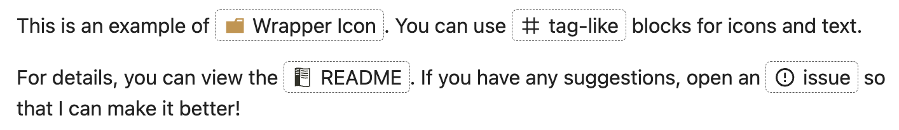
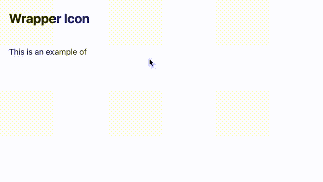
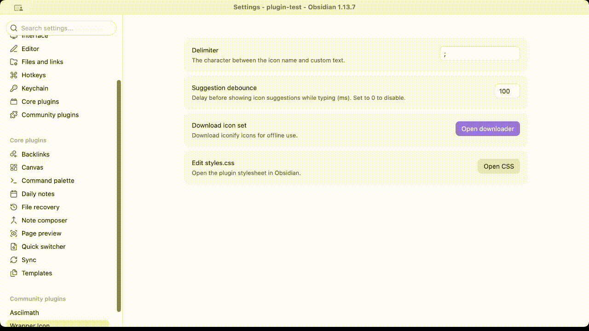

# Wrapper Icon

Render [Iconify](https://iconify.design/) icons with custom inline text in your notes, using locally downloaded icon sets — no internet connection needed once the icons are saved.



```
`/ico mdi:home;Home`
```

is rendered as an inline **Home** label with the `mdi:home` icon in front of it. The icon is fetched from a local Iconify JSON file and wrapped together with your text, so both stay on one line.

## Features

- **Inline icon + text wrapper** — write `` `/ico <set>:<icon>;<text>` `` in any note and it renders as a single inline element.
- **Fully offline** — icons are stored as local JSON files inside the plugin folder. Nothing is fetched from the network while reading or editing.
- **Icon set downloader** — search Iconify collections from the settings tab or a command and download them as offline JSON.
- **Live Preview support** — icons render directly in the editor; click one to jump back to the source and edit it.
- **Reading View support** — icons also render in Reading View via a Markdown post-processor.
- **Autocomplete** — start typing `` `/ico `` and the plugin suggests icons from your downloaded sets.
- **Customizable delimiter** — choose the separator between the icon name and the text (default `;`).

## Installation

Copy `main.js`, `manifest.json`, and `styles.css` to your vault:

```
<VaultFolder>/.obsidian/plugins/wrapper-icon/
```

Then enable **Wrapper Icon** in **Settings → Community plugins**.

## Usage

Use the icon inside a code span with this syntax:

```
`/ico <icon-set>:<icon-name><delimiter><text>`
```

- `<icon-set>` — the Iconify collection prefix (e.g. `mdi`, `lucide`, `ph`).
- `<icon-name>` — an icon name from that collection.
- `<delimiter>` — the separator character, `;` by default (configurable in settings).
- `<text>` — the text shown next to the icon. Can be empty to show only the icon.

Examples:

```
`/ico mdi:home;Home`
`/ico lucide:user;Profile`
`/ico ph:check-circle`
```

> ⚠️ The `<icon-set>:<icon-name>` prefix is required — the plugin only renders icons that are present in your locally downloaded sets.

Example in GIF:



### In the editor

- **Live Preview**: icons are rendered inline as you type. Click a rendered icon to select and edit its source.
- **Source mode**: write the raw `` `/ico ...` `` text.
- **Autocomplete**: type `` `/ico `` and pick an icon from the suggestion popup; the delimiter is inserted automatically.

## Getting started: download an icon set

Icon sets are downloaded from the official `@iconify-json` packages (via jsDelivr, falling back to unpkg). This is the only step that needs a network connection.

1. Run the command **Download iconify icon set**, or go to **Settings → Wrapper Icon → Download icon set**.
2. Search for a collection (by name or prefix), e.g. `Material Design Icons`.
3. Select the collection. Optionally enter a comma-separated list of icon names (leave empty to download the whole collection — some collections are large).
4. Click **Download selected collection**.

The set is saved to `.obsidian/plugins/wrapper-icon/assets/<prefix>.json` and is available immediately, offline.

To add icons to an already downloaded set, delete the set from the downloader (or the assets folder) and download it again.

Example in GIF:



## Settings

| Setting | Description |
| --- | --- |
| Delimiter | The character between the icon name and the custom text (default `;`). |
| Suggestion debounce | The delay (in milliseconds) before the autocomplete suggestions appear. |
| Download icon set | Opens the Iconify collection downloader. |
| Edit styles.css | Opens the plugin stylesheet (desktop only) so you can customize icon size, color, and layout. |

## Commands

| Command | Description |
| --- | --- |
| Reload local icon sets | Re-reads the JSON files in `assets/`, picking up sets added or changed manually. |
| Download iconify icon set | Opens the collection downloader. |

## Customizing the style

By default each wrapper is drawn with a thin dashed outline (`0.5px dashed`, `0.25rem` radius) and the icon uses `currentColor`, sized relative to the surrounding text. To change this, edit `styles.css` (button in settings) or add your own CSS targeting the `.plug-wrap-icon` / `.plug-wrap-icon-icon` classes, e.g. to remove the outline and recolor/resize the icon:

```css
.plug-wrap-icon {
  border: none;
  padding: 0;
}
.plug-wrap-icon-icon {
  color: var(--text-accent);
  width: 1.4em;
  height: 1.4em;
}
```

## Development

This plugin is built with TypeScript and esbuild. Requires Node.js 18+.

```bash
npm install       # install dependencies
npm run dev       # compile in watch mode
npm run build     # type-check (tsc) and produce a production build in main.js
npm run lint      # oxlint check
npm run format    # format source files with oxfmt
```

## Release

- Bump the version in `manifest.json` (SemVer) and `versions.json`, or run `npm version patch|minor|major`.
- Create a GitHub release tagged with the exact version (no leading `v`) and attach `main.js`, `manifest.json`, and `styles.css`.

## License

[MIT](./LICENSE)
